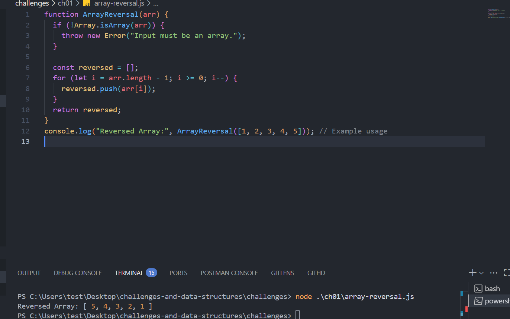
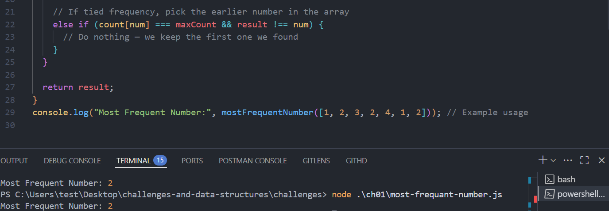
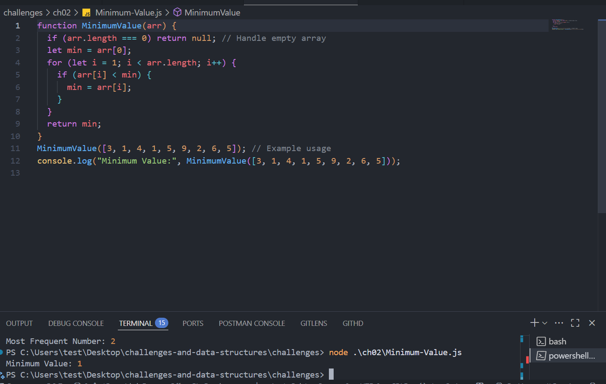
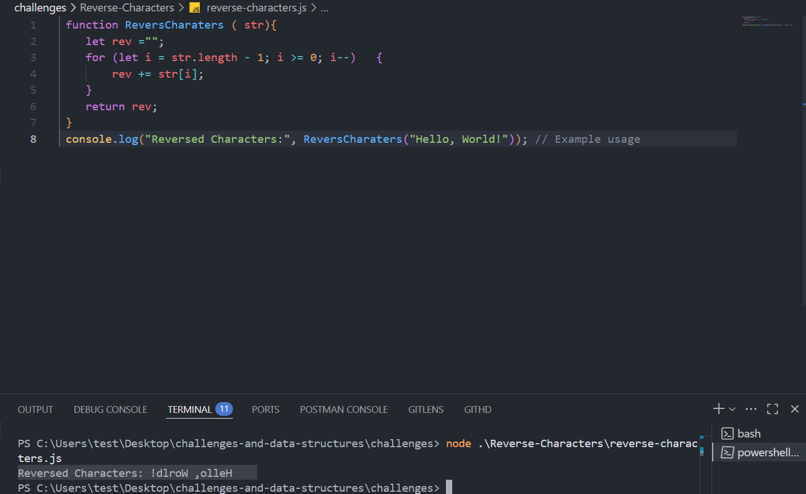
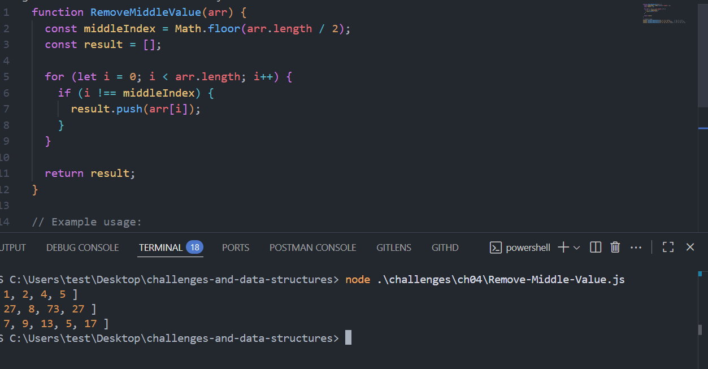

💻 My Dev Diary

👋 About Me
Hi! I'm a software development student learning JavaScript, data structures, and command-line tools. I’m passionate about solving real problems with clean and efficient code. This journey is both challenging and rewarding!

📘 What I Learned from Good Developer Mindset:
Consistency matters more than perfection.

Failure is part of learning — each mistake is a stepping stone.

Communication and teamwork are just as important as writing great code.

A growth mindset helps you keep improving.

💻 What I Learned from Terminal Command Cheat Sheet:
cd, ls, mkdir, and touch help me navigate and manage my files quickly.

git status and git branch are super useful for version control.

I now understand how to use git checkout -b to create and switch to a new branch.

💡 Don’t forget to take a screenshot of your terminal commands and place it in your project folder (e.g., in an /assets directory).

📝 Markdown Practice:
Bold, Italic, and Underline formatting

Inline code like git add .

Lists like:

Bullet points

Numbered steps

Headings: ##, ###, etc.

# Whiteboard Challenge 01 

## Challenge Description
This project contains solutions to two whiteboard coding challenges using JavaScript.

## Features

- ✅ Reverses an array without mutating the original.
- ✅ Finds the most frequent number in an array.
- 🧪 Easy to test with Node.js.
- 📂 Simple file structure for quick understanding.

## Whiteboard Image

## Array reversal

## Most Frequant Number

# Challenge 02: Minimum Value

## Challenge Description

Write a function called `MinimumValue` that accepts an array of integers.  
Without using any built-in methods, the function should return the smallest value in the array.

## Whiteboard Image

# Challenge 03: Reverse-Characters

## Challenge Description

Write a function called `ReversCharaters` that accepts a single string .  
Without using any built-in methods, the function return the characters in revers order.

## Whiteboard Image

### Challenge 04: Remove Middle Value

## Challenge Description

Write a function called RemoveMiddleValue that takes in an array as its parameter. Without using any built-in methods  the function should remove the value at the middle index of the array and return a new array.

## Whiteboard Image

## 📘 Linked List Implementation
[ Linked List implementation Documentation](./DataStructures/linkedlist/linked-list-implementation/README.md)
## 📘 Reversed Linked List 
[Reverse Linked List Documentation](./DataStructures/linkedlist/linked-list-implementation/Reverse/README.md)
# Merge Sorted Linked Lists
[mergeSorted Linked List Documentation](./DataStructures/linkedlist/linked-list-implementation/mergeSorted/README.md)
# Rotate Linked List
[Rotate Linked List Documentation](./DataStructures/linkedlist/linked-list-implementation/RotateLinkedList/README.md)
