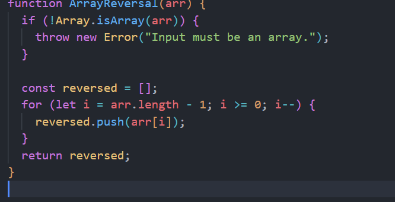
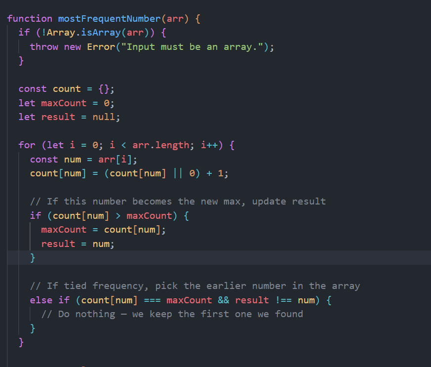

# Whiteboard Challenge 01 

## Challenge Description
This project contains solutions to two whiteboard coding challenges using JavaScript.

## Features

- ✅ Reverses an array without mutating the original.
- ✅ Finds the most frequent number in an array.
- 🧪 Easy to test with Node.js.
- 📂 Simple file structure for quick understanding.

## Whiteboard Image

## Array reversal

## Most Frequant Number
